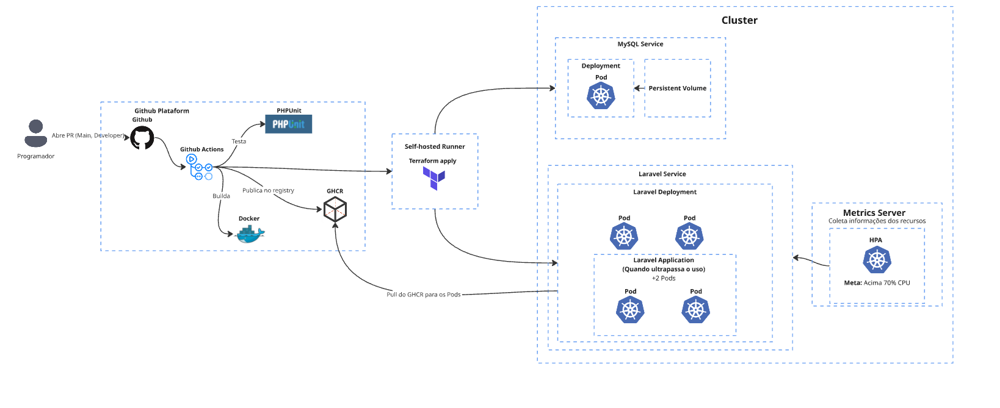

# TechChallenge API
API de autenticação construída com Laravel 13, JWT e MySQL, com ambiente de desenvolvimento via Docker Compose e documentação OpenAPI.

## Descrição da solução e objetivos da fase 2

Esta entrega consolida uma API Laravel com autenticação JWT e duas estratégias de execução:

- Ambiente local com Docker Compose para desenvolvimento e testes rápidos.
- Ambiente Kubernetes (Minikube) provisionado via Terraform para validar deploy, escalabilidade e operação em cluster.

Objetivos principais desta fase:

- Padronizar build e publicação de imagem Docker para o GHCR.
- Automatizar deploy e infraestrutura Kubernetes usando Terraform.
- Garantir rastreabilidade de mudanças por tags de imagem e pipeline CI/CD.
- Manter documentação executável para setup local e execução em cluster.

## Guia rápido desta documentação

- Execução local: veja a seção `Início rápido (do zero)` e `Configuração do ambiente`.
- Deploy em Kubernetes: veja a seção `Ambiente Kubernetes (Minikube + Terraform)`.
- Provisionamento com Terraform: veja a seção `Passo a passo` dentro de `Ambiente Kubernetes (Minikube + Terraform)`.

## Desenho da arquitetura proposta



## Stack
- PHP 8.4
- Laravel 13
- MySQL 8
- JWT para autenticação
- Docker Compose
- Swagger UI para visualização da documentação


## Pré-requisitos
Antes de iniciar, tenha instalado na máquina:

- Docker
- Docker Compose

## Início rápido (do zero)

Se você quer rodar o projeto com o mínimo de passos, execute:

```bash
make bootstrap
```

Depois, acesse:

- API: `http://localhost:8080`
- Swagger: `http://localhost:8082`

Para parar tudo:

```bash
docker compose down
```

## Serviços disponíveis

Ao subir o ambiente, os serviços ficam disponíveis em:

- API Laravel: `http://localhost:8080`
- Swagger UI: `http://localhost:8082`
- MySQL: `localhost:3308`

## Configuração do ambiente

### 1. Copie o arquivo de ambiente

```bash
cp .env.example .env
```

### 2. Revise as variáveis do banco

O projeto já vem configurado para usar o serviço `db` do Docker Compose. No `.env`, valide ao menos estes campos:

```env
DB_CONNECTION=mysql
DB_HOST=db
DB_PORT=3306
DB_DATABASE=techchallenge
DB_USERNAME=techchallenge
DB_PASSWORD=

JWT_SECRET=
```

Se quiser evitar inconsistência no MySQL, mantenha `DB_PASSWORD` preenchido com o mesmo valor usado no container.

Para gerar o JWT_SECRET precisa ter ao menos 256 bytes. Para facilitar utilize este comando e copie o output:

```
docker compose run --rm app-php php artisan jwt:secret
```

### 3. Suba os containers

```bash
docker compose up -d --build
```

### 4. Instale as dependências do PHP

```bash
docker compose run --rm app-php composer install
```

### 5. Gere a chave da aplicação
```bash
docker compose run --rm app-php php artisan key:generate
```

### 6. Rode as migrations
```bash
docker compose run --rm app-php php artisan migrate
```

## Como executar no dia a dia

Para iniciar o ambiente:

```bash
docker compose up -d
```

## Documentação da API

O contrato da API está no arquivo `openapi.yaml`.

Para visualizar a documentação no navegador, suba o serviço e acesse:

```text
http://localhost:8082
```
## Testes e qualidade de código

O projeto usa um `Makefile` para centralizar os comandos de teste, coverage e análise estática. Certifique-se de ter o `make` instalado na máquina.

### Referência rápida

| Comando | Descrição |
|---|---|
| `make help` | Lista todos os targets disponíveis |
| `make test` | Roda a suíte de testes **sem** gerar relatório de coverage (mais rápido) |
| `make coverage` | Roda os testes e gera `coverage.xml` via PCOV |
| `make scan` | Roda o SonarQube Scanner (requer `SONAR_TOKEN` e SonarQube em pé) |
| `make ci` | `coverage` + `scan` em sequência — ideal para pipelines de CI |
| `make all` | `up` + `coverage` + `scan` |
| `make up` | Sobe os containers de desenvolvimento em background |
| `make down` | Para e remove os containers de desenvolvimento |
| `make lint` | Formata o código com Laravel Pint |
| `make seed-dev` | Popula o banco de dados com informações principais |

### Rodar os testes

```bash
# Execução rápida, sem relatório de cobertura
make test

# Com geração de coverage.xml
make coverage
```

Os testes rodam dentro do container `app-test` definido em `docker-compose.test.yml`, usando um banco MySQL efêmero em tmpfs.

### Análise de cobertura com SonarQube

O SonarQube é configurado no `docker-compose.yml`. Na primeira execução, acesse `http://localhost:9000` para criar um projeto e gerar um token de acesso.

```bash
# Gera coverage e envia para o SonarQube
SONAR_TOKEN=sqa_xxxx make ci
```

O `SONAR_TOKEN` também pode ser exportado no shell para não precisar repeti-lo:

```bash
export SONAR_TOKEN=sqa_xxxx
make ci
```

## Observações

- O container `app-php` publica a aplicação na porta `8080` usando `php artisan serve`.
- O Swagger UI lê diretamente o arquivo `openapi.yaml` do projeto.
- O banco MySQL é exposto localmente na porta `3308`.

## Ambiente Kubernetes (Minikube + Terraform)

Além do Docker Compose (fluxo padrão do dia a dia), o projeto tem um segundo ambiente que roda a aplicação inteira dentro de um cluster Kubernetes local, via **Minikube**. É o ambiente usado sempre que você mexe em algo que impacta o deploy em si (Deployments, Services, HPA, ConfigMaps, Secrets).

Todo o provisionamento — desde o namespace até o Job de migration — é feito por um único diretório `infra/` no Terraform, usando o provider `kubernetes` (e `helm`, só para o metrics-server). Não existem `kubectl apply` soltos nem `local-exec` chamando o cluster por fora: cada manifest é um resource do Terraform, e o state fica todo em `infra/`.

### Papel de cada peça

| Peça | Papel |
|---|---|
| **Minikube** | Cria o cluster Kubernetes de um nó rodando localmente (por padrão, como um container Docker via seu próprio driver). |
| **Terraform** (`infra/`) | Orquestra **toda** a stack dentro do cluster: namespace, ConfigMaps, Secrets, MySQL (Deployment + Service + PV/PVC), Job de migration, Deployment/Service/HPA da aplicação, Deployment/Service do Swagger, e o `metrics-server` via Helm (necessário para o HPA). Cada peça é um resource nativo (`kubernetes_namespace_v1`, `kubernetes_deployment_v1`, `kubernetes_secret_v1` etc.) — nada é aplicado via shell. |
| **GitHub Actions** | `build-ghcr.yml` builda e publica a imagem no GHCR. `deploy-minikube.yml` roda `terraform apply` em um runner self-hosted com o Minikube já em pé, passando os segredos como variáveis do Terraform (`TF_VAR_*`). |

### Docker Compose vs Minikube — quando usar cada um

| | Docker Compose | Minikube + Kubernetes |
|---|---|---|
| Uso principal | Dia a dia, desenvolvimento | Validar o comportamento em Kubernetes (Deployments, HPA, Services) |
| Orquestração | `docker-compose.yml` | Resources Terraform (`kubernetes_*`) |
| Banco | Container `db` | Deployment MySQL dentro do cluster |
| Acesso externo | Portas mapeadas direto | Services + `minikube tunnel` |
| Escala | Manual | HPA (autoscaling automático) |

### Pré-requisitos

- Docker
- [Minikube](https://minikube.sigs.k8s.io/docs/start/)
- `kubectl`
- Terraform >= 1.6
- Um Personal Access Token do GitHub (classic) com escopo `read:packages`, para puxar a imagem do GHCR

### Passo a passo

**1. Suba o cluster**

Via Makefile: `make minikube-start`

Ou manualmente:
```bash
minikube start
kubectl config use-context minikube
```

**2. Configure as variáveis sensíveis**

`app_key`, `db_password` e `jwt_secret` **não precisam ser gerados de novo** — são os mesmos valores que já estão no seu `.env` (gerados no fluxo de Docker Compose acima, via `make bootstrap` ou os passos manuais 2 e 5). Reaproveitar evita, por exemplo, que o JWT emitido pela API do Compose seja invalidado ao rodar no Kubernetes com uma chave diferente:

```bash
grep -E '^(APP_KEY|DB_PASSWORD|JWT_SECRET)=' .env
```

Crie `infra/terraform.tfvars` com esses valores (está no `.gitignore` — nunca commitar com dados reais):

```hcl
app_key       = "base64:COPIE_DO_SEU_.ENV"
db_password   = "COPIE_DO_SEU_.ENV"
jwt_secret    = "COPIE_DO_SEU_.ENV"

ghcr_username = "SEU_USUARIO_GITHUB"
ghcr_token    = "SEU_TOKEN_COM_read:packages"

# Opcionais — já têm default em variables.tf, só defina se quiser sobrescrever:
# ghcr_email    = "SEU_EMAIL"
# mail_username = "SEU_EMAIL_SMTP"
# mail_password = "SUA_SENHA_DE_APP"
```

**3. Aplique com Terraform**

Via `Makefile` (recomendado — já valida se `terraform.tfvars` existe):

```bash
make infra-init
make infra-apply
# ou os dois passos de uma vez, incluindo o minikube start: make k8s-up
```

Ou manualmente:

```bash
cd infra
terraform init
terraform apply
cd ..
```

Isso cria o namespace, ConfigMaps, Secrets, MySQL, roda o Job de migration e sobe a aplicação e o Swagger — nessa ordem, controlada pelas dependências entre os resources.

### Acessando a documentação (Swagger)

Como o Service da app e o do Swagger são `LoadBalancer`, no Minikube eles só
recebem IP externo enquanto o túnel estiver ativo. Em um terminal separado,
deixe rodando:

```bash
make k8s-tunnel
```

Em outro terminal, com o túnel ativo, obtenha as URLs:

```bash
make k8s-urls
```

Isso imprime:

```bash
App:     http://127.0.0.1:xxxxx
Swagger: http://127.0.0.1:xxxxx
```

Abra a URL do **Swagger** no navegador para acessar a documentação interativa
da API (`openapi.yaml` da raiz do projeto).

**Para desligar tudo:**

Via Makefile: `make k8s-down`

Ou manualmente:
```bash
cd infra && terraform destroy && cd ..
minikube stop
```

### Atualizando a aplicação (nova imagem)

Como a tag da imagem (`image_tag`) faz parte do nome do Deployment e do Job de migration, basta rodar `terraform apply` de novo com uma tag nova para que o Terraform detecte a mudança, recrie o Job de migration e faça o rollout do Deployment automaticamente — sem precisar de `kubectl rollout restart` manual:

```bash
make infra-apply IMAGE_TAG=sha-abc1234
```

### Referência rápida (make)

| Comando | Descrição |
|---|---|
| `make minikube-start` | Sobe o cluster Minikube e seleciona o context |
| `make infra-init` | `terraform init` em `infra/` (valida se `terraform.tfvars` existe) |
| `make infra-plan` | `terraform plan` (aceita `IMAGE_TAG=<tag>`) |
| `make infra-apply` | `terraform apply` (aceita `IMAGE_TAG=<tag>`) |
| `make infra-destroy` | Remove toda a stack provisionada pelo Terraform |
| `make infra-reset` | Limpeza forçada (namespace + PV + dados do MySQL no host) — usar quando o cluster ficar num estado inconsistente com o Terraform |
| `make k8s-up` | `minikube-start` + `infra-init` + `infra-apply` em sequência |
| `make k8s-down` | `infra-destroy` + `minikube-stop` |
| `make k8s-status` | Mostra pods e services do namespace |
| `make k8s-urls` | Exibe as URLs de acesso (requer `minikube tunnel` rodando) |
| `make k8s-tunnel` | Abre o túnel do Minikube (`minikube tunnel`, roda em foreground)
